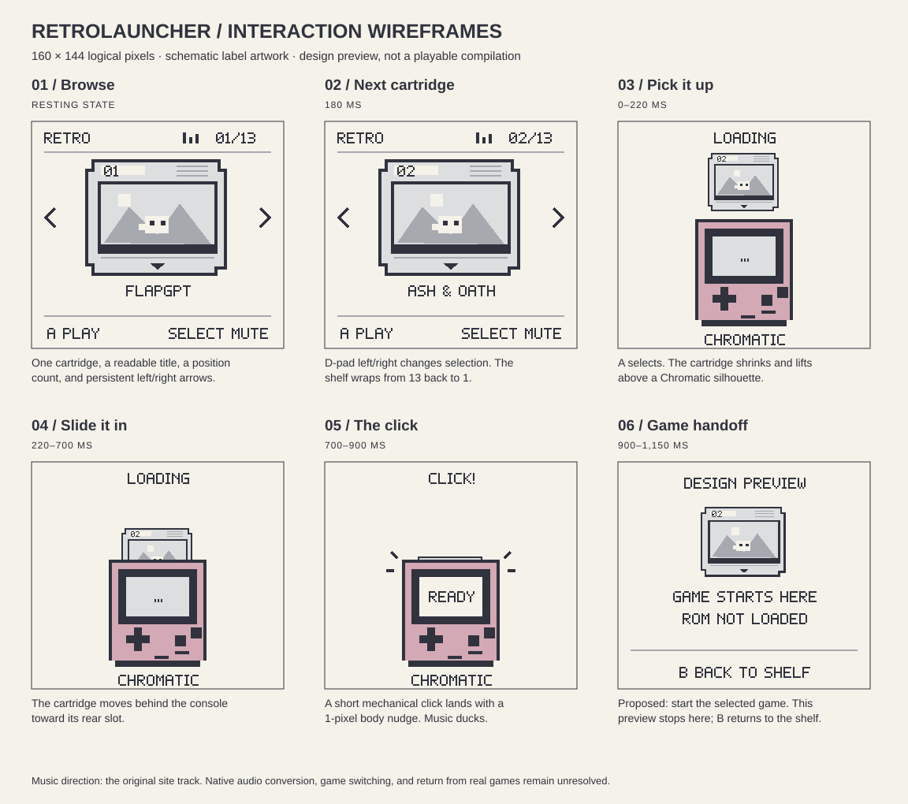

# Launcher wireframes

[Open interactive preview](https://nathanjohnpayne.github.io/retrolauncher/) · [Full-size storyboard](wireframes/storyboard.svg) · [Current status](../README.md#current-status)

## Screen and cartridge layout

Each proposed screen uses **160 × 144 logical pixels**. Pixel lettering, a compact position counter, and persistent left/right arrows make the small screen readable. The shelf shows one complete cartridge at a time, with the selected title below it. Long titles occupy two rows. The cartridge takes its visual cues from the [official collection](https://developers.openai.com/modretro): a numbered top edge, molded ridges, a large label area, and a bottom play marker. The label illustrations are schematic placeholders; final game-specific label artwork remains to be prepared.

The browse screen reserves the top 20 pixels for collection/position/music state, the middle for the cartridge, and the bottom for title and controls. Text stays within an 8-pixel side margin. Previous/next arrows remain visible, and navigation wraps from 13 to 1 and back. Only the cartridge moves during the 180 ms selection transition.

## Selection sequence

| Time after A | Screen | Intended feedback |
| --- | --- | --- |
| 0–220 ms | [Pick it up](wireframes/03-lift.svg) | Cartridge shrinks and lifts above a schematic Chromatic. |
| 220–700 ms | [Slide it in](wireframes/04-insert.svg) | Cartridge slides behind the handheld, into its rear slot. |
| 700–900 ms | [Click](wireframes/05-click.svg) | A brief noise-based mechanical click, a one-pixel body nudge, click marks, and momentary music duck. |
| 900–1,150 ms | [Handoff](wireframes/06-handoff.svg) | Proposed game start; browser stops at an explicit “ROM NOT LOADED” placeholder. |

In the preview, B returns to the selected cartridge; selecting another game is disabled during loading. This interaction does not establish a return shortcut inside the actual games. Reduced-motion mode skips directly to the handoff; the click has its own toggle. Browse screens: [first cartridge](wireframes/01-browse.svg), [next cartridge](wireframes/02-browse.svg).

## Audio direction

The optional browser music toggle plays the [original site MP3](https://developers.openai.com/modretro/audio/ambient-chiptune-loop.mp3), with no substituted recording. It starts only after user interaction. Availability depends on the official URL. The insertion click is generated locally with Web Audio. These demonstrate timing and feel; native Game Boy playback, arrangement/conversion, memory cost, and final sound design remain unimplemented.

## Review and implementation boundaries

The preview includes the titles of all 13 featured games and supports pointer, keyboard, a native-size view, and enlarged views. The six SVG screens share the same renderer as the interactive preview; regenerate them with `node scripts/render_wireframes.mjs`.

These are interface wireframes, not a hardware-ready asset pack. Tile/palette budgets, actual label conversion, native animation/audio performance, game switching, save isolation, and return-to-menu behavior still need implementation and validation. See [hardware feasibility](hardware-feasibility.md) for the 4 MiB cartridge constraint and the source-project request.
